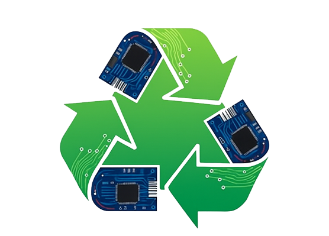

<?php
echo '<!DOCTYPE html>';
echo '<html lang="pt-br">';
echo '<head>';
echo '    <meta charset="UTF-8">';
echo '    <meta name="viewport" content="width=device-width, initial-scale=1.0">';
echo '    <title>EcoBit</title>';
echo '    <link rel="stylesheet" href="src/css/menuStyle1.css">';
echo '</head>';
echo '<body>';
echo '    <header>';
echo '        
';
echo '            <a href="index.php" class="logo">EcoBit</a>';

// Formulário de busca e área de resultados
echo '            
';
echo '                <form action="catalogo.php" method="GET">';
echo '                    <input type="text" id="search-box" name="q" placeholder="Digite sua pesquisa..." autocomplete="off" onkeyup="liveSearch()">';
echo '                    <button class="search-button" type="submit">Buscar</button>';
echo '                </form>';
echo '                

';
echo '            
';

echo '            
Olá, <a href="login.php">Entre</a> ou  <a href="cadastrar.php">Cadastre-se</a>
';
echo '        
';
echo '        <nav>';
echo '            <a href="SobreNos.php">Sobre Nós</a>';
echo '            <a href="Atendimento.php">Atendimento</a>';
echo '            <a href="Sustentabilidade.php">Sustentabilidade</a>';
echo '            <a href="Promocoes.php">Promoções</a>';
echo '        </nav>';
echo '    </header>';
?>

<?php
require_once 'conectar.php';
?>